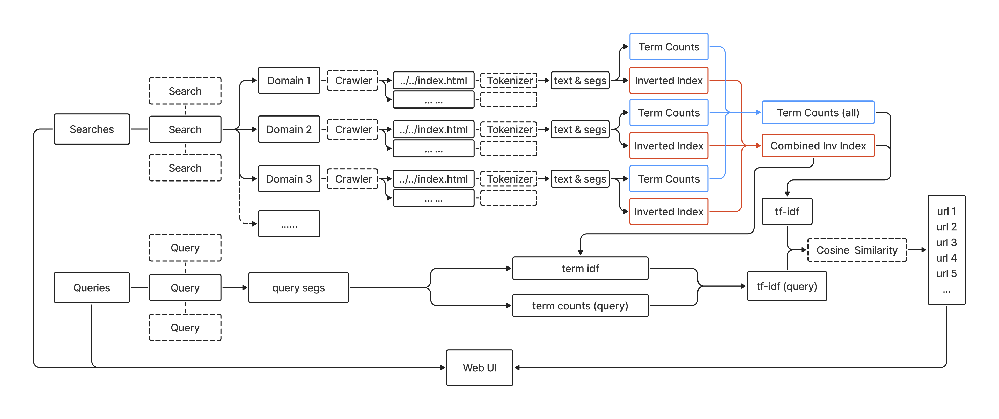

# 结合字符串重排的 TF-IDF 搜索系统

## 项目目标

实现基于(python)网络爬虫以及 TF-IDF 算法的小型搜索引擎。

## 项目亮点

- **多线程爬虫**实现，对比不同线程数爬虫的爬取速度
- 使用**树状储存结构**对爬取到的网页进行储存管理，具有很强的可读性与可操作性
- 两种**爬虫策略**（BFS、DFS）对比
- **定制化**搜索范围，可自定义多个域名下的搜索
- 基于**字符串匹配**的小范围重排机制，提升推荐效果
- **模块化**程序设计，易于扩展与维护
- Web UI设计，便于用户快速匹配目标页面

## 项目（代码）框架

```
.
├── main.py // 主程序入口，模块功能封装，用于接入Web UI和评测模块
├── crawler.py // 爬虫模块
├── tokenizer.py // 基于jieba的分词模块
├── ii_tc.py // 建立倒排索引与词频统计
├── tf_idf.py // tf-idf计算与保存
├── query.py // 查询模块
├── build.py // 控制单个域名下的模块进度
├── history.py // 控制搜索的domain组合的状态
├── utils.py // 实用函数
├── eval_client.py // 评测模块
├── eval_search_engine.py
├── app.py // 基于flask的Web UI
├── static
│   ├── script.js
│   └── style.css
└── templates
    └── index.html
```

## 项目流程图



## 项目运行

安装依赖后运行
```
python app.py
```
即可在本地运行Web UI